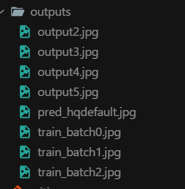

# Bee Varroa Destructor


A computer vision prototype for detecting **Varroa destructor** mites in bee images using a YOLO model, with a simple FastAPI inference endpoint and basic training metrics visualization.

## Preview


*Raw input photo used for mite detection.*


*Model output with detected mite locations.*


*Annotated image returned by the FastAPI `/predict/` endpoint.*

## Project Goal

The goal is to speed up and support early visual diagnosis of mite infestation from bee photos, helping reduce manual inspection effort.

## What Is Already Implemented

- YOLO-based image inference from a local script (`main.py`)
- API endpoint for image upload and annotated-image return (`fast_api.py`)
- Training history plotting for losses and detection metrics (`graph.py`)
- Saved training log in `results.csv` (51 epochs)

## Current Results (from `results.csv`)

- Best precision: **0.79586** (epoch 9)
- Best recall: **0.82470** (epoch 1)
- Best mAP50: **0.80630** (epoch 22)
- Best mAP50-95: **0.30403** (epoch 1)

## Project Structure

- `main.py` - runs YOLO inference on a test image and saves output
- `fast_api.py` - FastAPI server exposing `/predict/` for uploaded images
- `graph.py` - plots training and validation losses + metrics
- `results.csv` - training history exported from YOLO run

## Quick Start

### 1) Install dependencies

```bash
pip install ultralytics fastapi uvicorn pillow pandas matplotlib
```

### 2) Run local image inference

```bash
python main.py
```

Notes:
- `main.py` expects model weights in `best.pt`
- `main.py` uses `test_bee.jpg` as the input image

### 3) Run API

```bash
uvicorn fast_api:app --reload
```

Then send a file to:

```text
POST /predict/
```

Notes:
- `fast_api.py` expects model weights in `last.pt`
- Uploaded files are stored in `uploads/`
- Predictions are saved to `outputs/`

### 4) Show training plots

```bash
python graph.py
```

## Images

Add your screenshots/photos to this section (for example: input image, detected output, training chart, API result).
The `Preview` section at the top expects these `.jpg` files in `images/`:
- `images/input_bee.jpg`
- `images/prediction_result.jpg`
- `images/api_response.jpg`

Suggested files:
- `images/input_example.jpg`
- `images/output_prediction.jpg`
- `images/training_metrics.png`

Example markdown:

```md


```

## Next Steps

- Improve dataset quality and class balance
- Evaluate on a separate external validation set
- Add confidence threshold and model version to API response
- Containerize the API for easier deployment

## License

No license file is currently included in this repository. Add a `LICENSE` file if you want to define usage terms.
